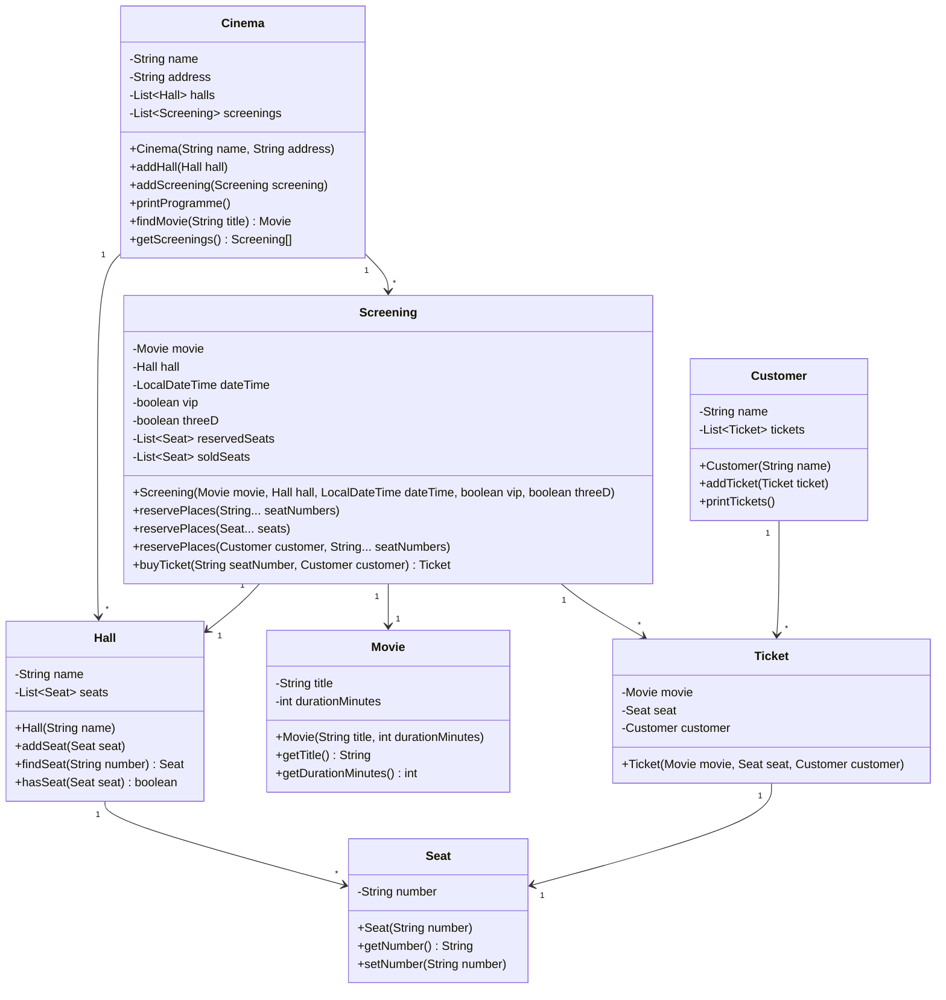

# Cinema Multiplex System

## Class diagram

```mermaid
classDiagram

    class Cinema {
        -String name
        -String address
        -List~Hall~ halls
        -List~Screening~ screenings
        +Cinema(String name, String address)
        +addHall(Hall hall)
        +addScreening(Screening screening)
        +printProgramme()
        +findMovie(String title) Movie
        +getScreenings() Screening[]
    }

    class Hall {
        -String name
        -List~Seat~ seats
        +Hall(String name)
        +addSeat(Seat seat)
        +findSeat(String number) Seat
        +hasSeat(Seat seat) boolean
    }

    class Seat {
        -String number
        +Seat(String number)
        +getNumber() String
        +setNumber(String number)
    }

    class Movie {
        -String title
        -int durationMinutes
        +Movie(String title, int durationMinutes)
        +getTitle() String
        +getDurationMinutes() int
    }

    class Screening {
        -Movie movie
        -Hall hall
        -LocalDateTime dateTime
        -boolean vip
        -boolean threeD
        -List~Seat~ reservedSeats
        -List~Seat~ soldSeats
        +Screening(Movie movie, Hall hall, LocalDateTime dateTime, boolean vip, boolean threeD)
        +reservePlaces(String... seatNumbers)
        +reservePlaces(Seat... seats)
        +reservePlaces(Customer customer, String... seatNumbers)
        +buyTicket(String seatNumber, Customer customer) Ticket
    }

    class Customer {
        -String name
        -List~Ticket~ tickets
        +Customer(String name)
        +addTicket(Ticket ticket)
        +printTickets()
    }

    class Ticket {
        -Movie movie
        -Seat seat
        -Customer customer
        +Ticket(Movie movie, Seat seat, Customer customer)
    }

    Cinema "1" --> "*" Hall
    Cinema "1" --> "*" Screening
    Hall "1" --> "*" Seat
    Screening "1" --> "1" Movie
    Screening "1" --> "1" Hall
    Screening "1" --> "*" Ticket
    Customer "1" --> "*" Ticket
    Ticket "1" --> "1" Seat
```
